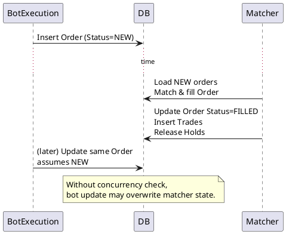

# Concurrency and Locking

Guidance for safe modifications to trading/bot logic in the monolith.

## Current Model (Risks)
- No EF rowversion/timestamp on critical tables (Wallets, Orders, Trades, OrderHolds).
- No distributed locking; background services run independently.
- In-memory cache/backplane only; multi-instance would race.
- Concurrency risks:
  - Wallet double-spend when multiple orders/bots place holds concurrently.
  - OrderMatching and BotExecution racing to update orders/trades.
  - Duplicate background runs in multi-instance deployments.

## Entities & Interactions
- Wallets + WalletMovements + OrderHolds: holds reserve funds; settlement updates WalletMovements.
- Orders (NEW → PARTIAL → FILLED/CANCELED/REJECTED) plus Trades; matcher updates status/fills.
- Bots place orders through TradingService; matcher consumes orders.

## Practical Rules (single instance)
- Wrap order placement + hold creation in a DB transaction.
- Always re-read order status before updating (avoid stale assumptions).
- Check `Status` before settlement; skip if already terminal.
- In matcher, process only PENDING/NEW orders and commit atomically with trades.
- For bots, handle exceptions so failed runs do not leave partial state unhandled.

## Target Improvements
- Optimistic concurrency:
  - Add `RowVersion` byte[] (timestamp) to Wallets and Orders; handle `DbUpdateConcurrencyException` with retry/abort.
- Per-wallet locks:
  - Introduce an application-level lock (per WalletId) around balance/hold mutations.
- Distributed locking (for multi-instance):
  - Redis-based lock for OrderMatching loop and BotExecution batches (or per bot).
- Idempotency:
  - Unique constraints on `(Provider, OrderId/TransactionId)` for payments; idem keys for order placement APIs.
- Backplane:
  - Redis backplane for SignalR and cache coherence.

## Multi-Instance Hazards
- Duplicate matches: two matchers fill the same orders → double-settlement.
- Duplicate bot runs: two executors place duplicate orders.
- Payment callbacks: duplicate processing without idempotent keys.
- Mitigate with distributed locks + idempotency tables before scaling out.

## Sequence Diagrams (PlantUML)

### Concurrent Order Placements (Risk: double-spend)
```plantuml
@startuml
actor UserA
actor UserB
participant API as API/TradingService
database DB

== Race ==
UserA -> API: PlaceOrder (Wallet X)
API -> DB: Begin Tx\nRead Wallet X
UserB -> API: PlaceOrder (Wallet X)
API -> DB: Begin Tx\nRead Wallet X

note over API: Both see same balance (no lock/rowversion)

API -> DB: Insert OrderHold A\nInsert Order A
API -> DB: Commit
API -> DB: Insert OrderHold B\nInsert Order B
API -> DB: Commit

note over DB: Balance oversubscribed\n(double-spend risk)
@enduml
```

**Guidance:** add rowversion or per-wallet lock so second transaction retries/aborts when balance is stale.

### Bot vs Matcher (Risk: conflicting updates)


**Guidance:** use rowversion on Orders; bot should re-fetch before updating; avoid updates that assume NEW after matcher may run.

## Developer Checklist
- When touching Wallet/Order/Trade/OrderHold:
  - Consider rowversion + retry on concurrency exception.
  - Keep all related mutations in a single transaction.
- When adding background loops:
  - Add optional distributed lock for multi-instance.
  - Make operations idempotent where possible.
- When adding new SignalR broadcasters:
  - For scale-out, require Redis backplane; otherwise keep single-instance.
- Payments:
  - Enforce unique external transaction IDs; gate processing by status.
